# MVP-Engenharia-de-Dados---Especializacao-Ciencia-de-Dados-e-Analytics---PUCRJ

## Introdução ao projeto

O projeto consiste na aplicação dos conceitos de engenharia de dados na elaboração de um ambiente analitico (Data Mart) para a área de risco de crédito. 

## Contextualizando
O Risco de Crédito está relacionado à possibilidade de um cliente não cumprir suas obrigações financeiras, como atrasar ou deixar de pagar um empréstimo. Para lidar com esse risco, instituições financeiras utilizam modelos analíticos que estimam indicadores como a Probabilidade de Default (PD), a Exposição ao Default (EAD) e a Perda Esperada (PE), permitindo avaliar o risco tanto de clientes individuais quanto da carteira como um todo.

Para que essas análises sejam confiáveis e escaláveis, é fundamental que os dados estejam organizados e modelados de forma adequada. Nesse contexto, a criação de um Datamart de Risco de Crédito permite estruturar informações relevantes (cliente, geografia, tempo, setor e canal) em um modelo analítico, facilitando consultas, análises comparativas e a visualização do risco sob diferentes perspectivas, com o intuito de entender comportamentos e tendencias para aprimoramento de modelos que auxiliam na mitigação de riscos.

## Perguntas a serem respondidas

### Geografia:
- Quais UFs com maior EAD (último mês)?
- Quais Regiões com maior EAD (último mês)?
- Quais UFs com maior Perda Esperada no último mês?
- Quais UFs somam 80% do EAD (último mês)?
- Qual a taxa de recuperação por UF (valor_recuperado / perda_esperada) no último mês?
- Qual a evolução mensal de EAD por UF (últimos 12 meses)?
- Qual o crescimento de EAD por UF (mês atual vs mês anterior)?

### Clientes:
- Qual a relação entre tempo de conta e risco?
- Qual a relação entre tempo de emprego e risco?
- A PD Modelo e PD Real por setor estão muito diferentes?
- A PD Modelo e PD Real por escolaridade estão muito diferentes?
- Qual o risco (Perda Esperada) por escolaridade?
- A PD Modelo e PD Real por faixa etária estão muito diferentes?
- Qual a inadimplência média por idade?

As análises de Geografia permitem identificar concentrações regionais de risco e exposição ao crédito, enquanto as análises de Cliente exploram como o perfil etário influencia o comportamento de risco, score e perda esperada da carteira.

## Sobre o projeto

### Catálogo gerado

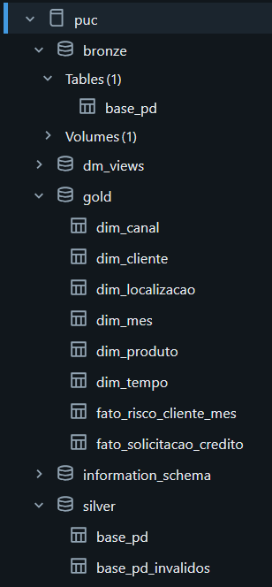

### Processo

O processo de ETL para criação do Data Mart foi desenvolvido em 4 etapas:

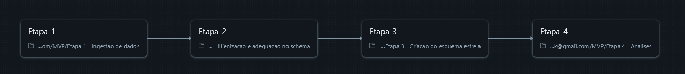

#### Etapa 1 - Ingestão de dados:

* Criação da Camada Bronze

Esta é a etapa mais simples do pipeline, na qual os dados são extraídos diretamente de sua fonte de origem, o Google Drive, e carregados no Databricks apenas para conversão em tabela no catálogo. Nessa fase, não é realizado nenhum tipo de processamento ou transformação nos dados, servindo exclusivamente como etapa de ingestão.

A base utilizada é composta por dados gerados artificialmente, com o objetivo de simular um cenário de risco de crédito voltado ao monitoramento de modelos de risco. O conjunto de dados possui aproximadamente 1 milhão de registros e inclui informações com datas projetadas para o futuro, característica que foi devidamente considerada durante a etapa de validação e higienização dos dados, garantindo consistência e aderência ao contexto do problema analisado.

##### Dicionário das variáveis

| Variável                       | Descrição                                               |
| ------------------------------ | ------------------------------------------------------- |
| `id_cliente`                   | Identificador único do cliente                          |
| `data_solicitacao`             | Data em que o crédito foi solicitado                    |
| `uf`                           | Unidade Federativa (estado) do cliente                  |
| `regiao`                       | Região do Brasil correspondente ao estado               |
| `idade`                        | Idade do cliente                                        |
| `tempo_conta_anos`             | Tempo de relacionamento do cliente com o banco, em anos |
| `escolaridade`                 | Grau de instrução do cliente                            |
| `estado_civil`                 | Estado civil do cliente                                 |
| `vinculo_emprego`              | Tipo de vínculo empregatício do cliente                 |
| `setor`                        | Setor de atuação profissional do cliente                |
| `tempo_emprego_anos`           | Tempo no emprego atual, em anos                         |
| `canal`                        | Canal utilizado para contratar o crédito                |
| `produto`                      | Tipo de crédito contratado                              |
| `usa_internet_banking`         | Indica se o cliente utiliza internet banking            |
| `possui_cartao_credito`        | Indica se o cliente possui cartão de crédito ativo      |
| `possui_investimentos`         | Indica se o cliente possui investimentos no banco       |
| `possui_seguro`                | Indica se o cliente possui seguro contratado            |
| `qtd_produtos_bancarios`       | Quantidade de produtos bancários ativos                 |
| `renda_mensal_atual`           | Renda mensal atual declarada pelo cliente               |
| `renda_mensal_anterior`        | Renda mensal declarada no período anterior              |
| `atrasos_passados`             | Quantidade de atrasos em pagamentos anteriores          |
| `score_credito`                | Score de crédito do cliente                             |
| `parcelas`                     | Número de parcelas do contrato                          |
| `valor_emprestimo`             | Valor do empréstimo contratado                          |
| `taxa_juros_mensal`            | Taxa de juros mensal aplicada ao contrato               |
| `valor_parcela`                | Valor da parcela do empréstimo                          |
| `dti`                          | Proporção entre o valor da parcela e a renda mensal     |
| `frequencia_transacoes`        | Frequência mensal de transações bancárias               |
| `valor_emprestimos_anteriores` | Valor total de empréstimos contratados anteriormente    |
| `pd_true`                      | Probabilidade real de inadimplência observada           |
| `inadimplente`                 | Indicador de inadimplência do cliente                   |
| `ead`                          | Valor exposto no contrato de crédito                    |
| `lgd`                          | Proporção da perda financeira em caso de inadimplência  |
| `valor_recuperado`             | Valor recuperado após inadimplência                     |
| `pd_model`                     | Probabilidade de inadimplência estimada por modelo      |

#### Etapa 2 - Higienização e adequação no schema:

* Criação da Camada Silver

Nesta etapa, a tabela previamente criada na camada Bronze passa por tratamentos e validações com o objetivo de garantir que os dados estejam padronizados de acordo com regras de domínio, formatos e negócio, preparando-os para uso analítico nas camadas seguintes.

Resumo das regras e padronizações:
        
1 - Padronização de Tipos e Formatos: Nesta parte, os dados tiveram seus tipos explicitamente convertidos para formatos adequados ao uso analítico, com especial atenção a campos de data, numéricos e textuais. Datas foram normalizadas para tipos temporais corretos, valores numéricos ajustados para tipos compatíveis e campos textuais padronizados (minúsculas e remoção de inconsistências), garantindo consistência em filtros, agregações e junções futuras.

2 - Validação de Domínios Fechados: Foram aplicadas validações baseadas em domínios fechados definidos no catálogo de dados, como Unidades Federativas e regiões do Brasil. A região foi derivada diretamente da UF, assegurando coerência geográfica. Campos categóricos relevantes passaram por padronização e validação contra conjuntos permitidos, reduzindo ambiguidades e problemas de cardinalidade.

3 - Regras de Consistência entre Atributos: Validações cruzadas foram implementadas para garantir coerência entre atributos relacionados. A idade do cliente foi restringida a intervalos plausíveis, o tempo de relacionamento validado para evitar valores negativos e as datas verificadas para respeitar a ordem temporal esperada. Essas regras asseguram a representatividade realista dos registros do ponto de vista de negócio.

4 - Tratamento de Valores Nulos e Ausentes: Os valores nulos foram analisados atributo a atributo, com definição de estratégias específicas conforme a criticidade de cada campo. Campos essenciais tiveram tratamento mais restritivo, enquanto atributos secundários puderam receber valores padrão ou categorização explícita. O objetivo foi preservar informação relevante sem comprometer a qualidade analítica.

5 - Validação de Valores Numéricos: Foram aplicadas regras para garantir que valores numéricos respeitassem limites mínimos e máximos esperados, como a não negatividade de valores monetários. Valores claramente inconsistentes com o domínio do problema foram tratados para evitar distorções em métricas agregadas, como saldo devedor, EAD e perda esperada.

6 - Controle de Duplicidade e Integridade: A duplicidade de registros foi tratada a partir da identificação de chaves naturais e da criação de chaves degeneradas baseadas em hash. Essa abordagem permitiu representar eventos únicos de forma consistente, garantindo rastreabilidade, integridade dos dados e evitando contagens duplicadas nas análises posteriores.

7 - Preparação para Modelagem Analítica: Os dados foram adequados para uso analítico, com garantia de granularidade consistente e separação clara entre atributos dimensionais e métricas quantitativas. Essa preparação alinhou a camada Silver ao modelo dimensional adotado, facilitando a criação do esquema estrela e a construção da camada Gold.

##### Domínios e Intervalos Permitidos das Colunas

Abaixo está a tabela contendo os domínios de cada variável, os quais foram aplicados na etapa de validação de dados.
###### Legenda:
* `+∞` = sem limite superior  
* `today` = data atual  
* Booleanos aceitam `{true, false}` (ou `{0,1}`, conforme padrão do dataset)

| Coluna | Tipo | Domínio / Intervalo Permitido | Aceita Nulo |
|------|------|-------------------------------|-------------|
| `uf` | set | `ac, al, ap, am, ba, ce, df, es, go, ma, mt, ms, mg, pa, pb, pr, pe, pi, rj, rn, rs, ro, rr, sc, sp, se, to` | Não |
| `regiao` | set | `norte, nordeste, centro-oeste, sudeste, sul` | Não |
| `canal` | set | `app, internet banking, agencia, correspondente` | Não |
| `produto` | set | `consignado, veiculo, pessoal, home_equity, cartao` | Sim |
| `escolaridade` | set | `medio, fundamental, pos, superior` | Não |
| `estado_civil` | set | `solteiro, divorciado, casado, viuvo` | Não |
| `vinculo_emprego` | set | `clt, autonomo, servidor, desempregado, empresario, estudante` | Não |
| `setor` | set | `educacao, saude, comercio, industria, ti, construcao, servicos, outro` | Não |
| `usa_internet_banking` | boolean | `true, false` | Não |
| `possui_cartao_credito` | boolean | `true, false` | Não |
| `possui_investimentos` | boolean | `true, false` | Não |
| `possui_seguro` | boolean | `true, false` | Não |
| `inadimplente` | set | `0, 1` | Não |
| `data_solicitacao` | date_range | `1900-01-01` até `today` | Não |
| `idade` | range | `0` a `120` | Não |
| `tempo_conta_anos` | range | `0` a `+∞` | Não |
| `tempo_emprego_anos` | range | `0` a `+∞` | Sim |
| `qtd_produtos_bancarios` | range_int | inteiros `0` a `+∞` | Não |
| `renda_mensal_atual` | range | `0` a `+∞` | Sim |
| `renda_mensal_anterior` | range | `0` a `+∞` | Sim |
| `atrasos_passados` | range_int | inteiros `0` a `+∞` | Não |
| `score_credito` | range | `0` a `1000` | Não |
| `parcelas` | range_int | inteiros `1` a `+∞` | Não |
| `valor_emprestimo` | range | `0` a `+∞` | Não |
| `taxa_juros_mensal` | range | `0` a `+∞` | Não |
| `valor_parcela` | range | `0` a `+∞` | Não |
| `dti` | range | `0` a `+∞` | Não |
| `frequencia_transacoes` | range | `0` a `+∞` | Não |
| `valor_emprestimos_anteriores` | range | `0` a `+∞` | Sim |
| `pd_true` | range | `0` a `1` | Não |
| `pd_model` | range | `0` a `1` | Não |
| `lgd` | range | `0` a `1` | Não |
| `ead` | range | `0` a `+∞` | Não |
| `valor_recuperado` | range | `0` a `+∞` | Não |

#### Etapa 3 - Criação do esquema estrela:

* Criação da Camada Gold

Por fim, nesta etapa é realizada a criação do Data Mart. A partir da tabela da camada Silver, são construídas as tabelas dimensionais e as tabelas fato. As dimensões criadas são dim_tempo, dim_localizacao, dim_cliente, dim_produto e dim_canal, enquanto as tabelas fato são fato_risco_cliente_mes e fato_solicitacao_credito. O esquema estrela resultante, bem como as variáveis e seus respectivos tipos de dados, pode ser visualizado na imagem a seguir.

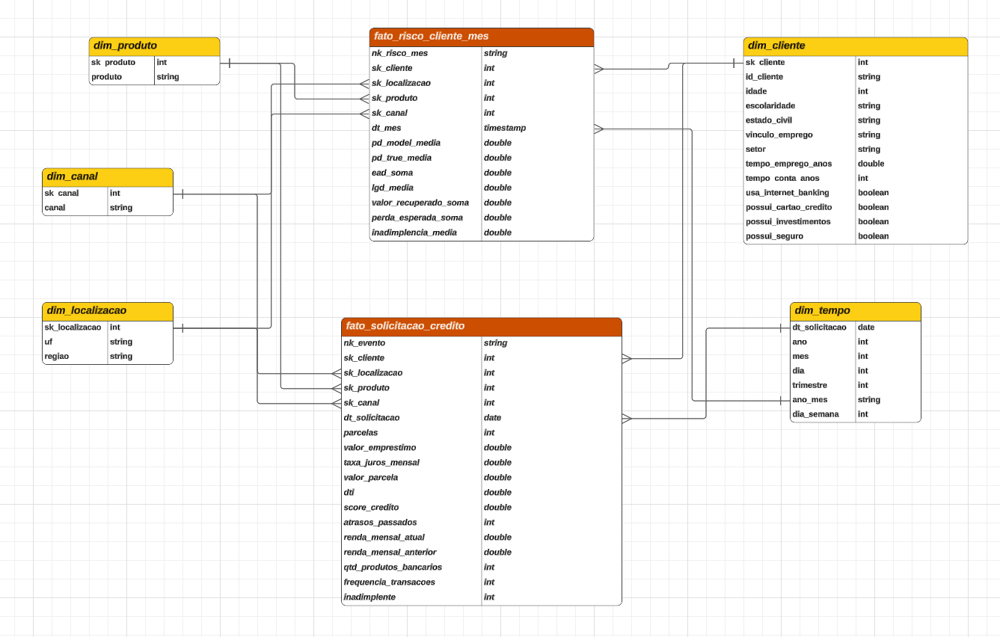

1 -  Dimensão Tempo:

* A dimensão tempo foi criada a partir da data de solicitação, com derivação de atributos como ano, trimestre e mês para análises temporais.

2 -  Dimensão Localização:

* A dimensão localização consolidou UF e região, com a região derivada diretamente da UF para garantir padronização geográfica.

3 - Dimensão Cliente:

* A dimensão cliente reuniu atributos demográficos e socioeconômicos, sendo identificada por chave substituta para evitar duplicidades.

4 - Dimensão Produto e Canal:

* Produto e canal foram modelados como dimensões independentes, seguindo o padrão.

5 - Chaves Substitutas (Surrogate Keys - sk's):

* Foram geradas chaves substitutas para todas as dimensões, assegurando integridade referencial e independência das chaves naturais.

6 - Chaves Degeneradas:

* Identificadores do próprio evento foram mantidos na tabela fato como chaves degeneradas, preservando rastreabilidade sem aumentar a complexidade do modelo.

#### Etapa 4 - Analises

* Criação das Análises utilizando a Camada Gold

Etapa em que o Data Mart está preparado para ser utilizado a fim de responder as perguntas elaboradas.

## Respondendo as perguntas

As consultas referentes às perguntas definidas encontram-se no notebook “Etapa 4 – Análises”. As perguntas foram organizadas em duas visões distintas: uma com foco na relação entre risco e a distribuição geográfica (Geografia) e outra com foco na relação entre risco e o perfil do cliente (Cliente). Para fins de identificação, adotou-se a nomenclatura GP para perguntas de Geografia (por exemplo, GP1 – Geografia Pergunta 1) e CP para perguntas relacionadas ao Cliente (por exemplo, CP7 – Cliente Pergunta 7).

O relatório analítico (dashboard) pode ser visualizado no arquivo “Relatorio-MVP-EngDados.lvdash.json”.

### Geografia:

- GP1 - Quais UFs com maior EAD (último mês)?

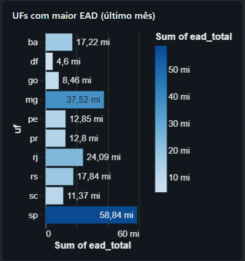

- GP2 - Quais Regiões com maior EAD (último mês)?

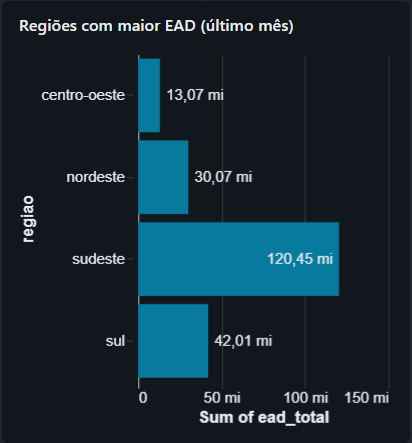

- GP6 - Quais UFs com maior Perda Esperada no último mês?

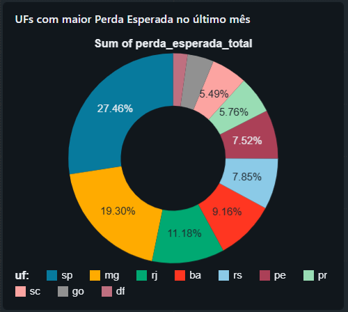

- GP10 - Quais UFs somam 80% do EAD (último mês)?

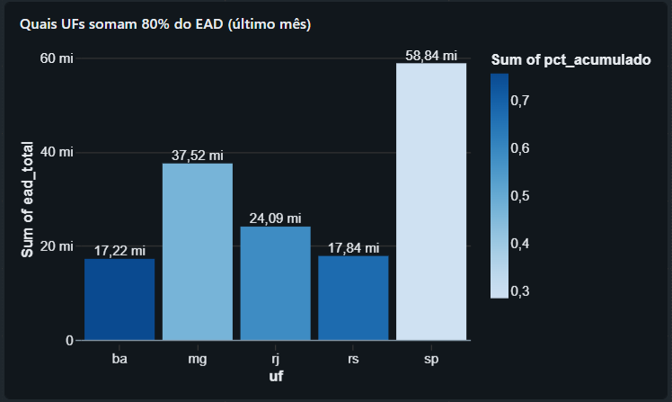

- GP7 - Qual a taxa de recuperação por UF (valor_recuperado / perda_esperada) no último mês?

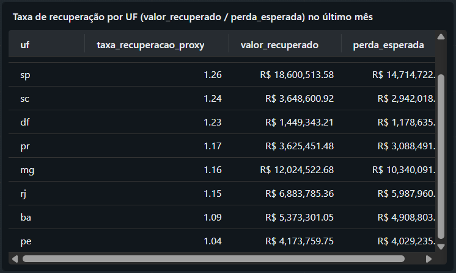

- GP8 - Qual a evolução mensal de EAD por UF (últimos 12 meses)?

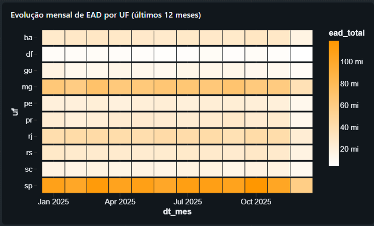

- GP9 - Qual o crescimento de EAD por UF (mês atual vs mês anterior)?

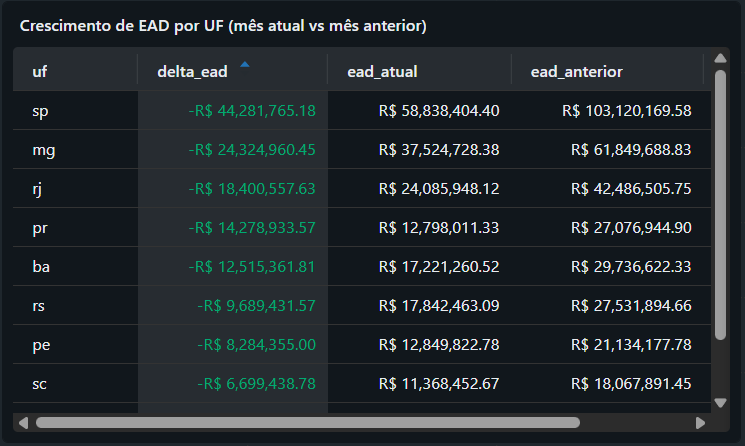

### Clientes:

- CP1 - Qual a relação entre tempo de conta e risco?

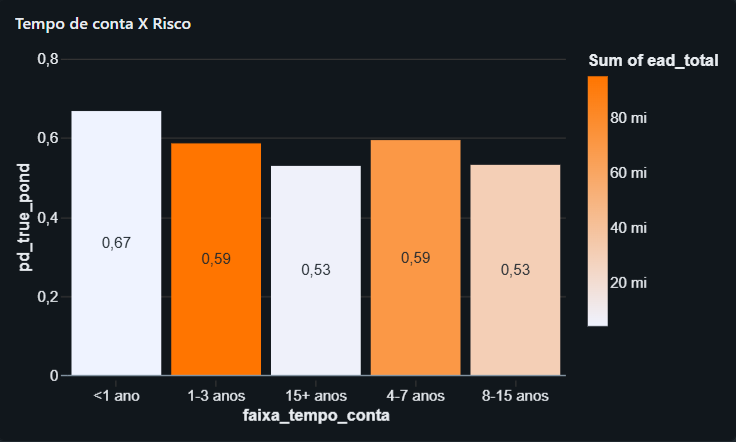

- CP2 - Qual a relação entre tempo de emprego e risco?

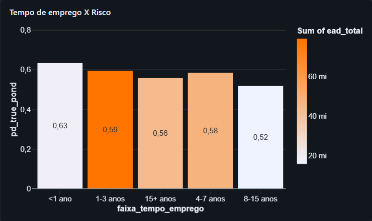

- CP3 - A PD Modelo e PD Real por setor estão muito diferentes?

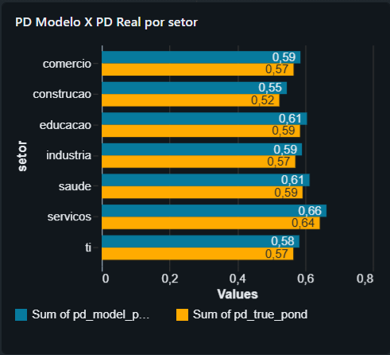

- CP7 - A PD Modelo e PD Real por escolaridade estão muito diferentes?

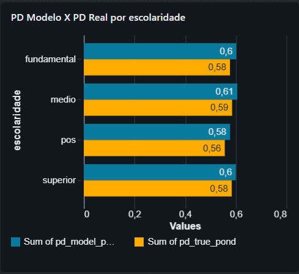

- CP4 - Qual o risco (Perda Esperada) por escolaridade?

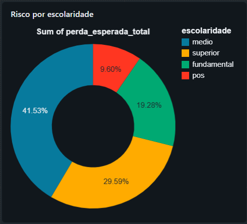

- CP5 - A PD Modelo e PD Real por faixa etária estão muito diferentes?

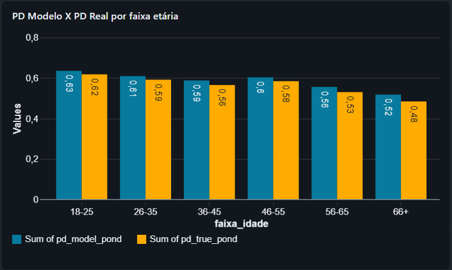

- CP6 - Qual a inadimplência média por idade?

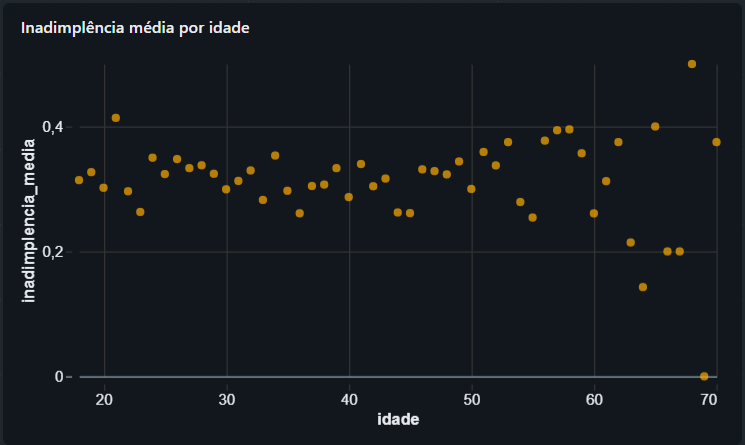

## Auto-avaliação

O projeto teve como objetivo facilitar a análise e exploração dos dados por meio de uma modelagem adequada. Considera-se que esse objetivo foi alcançado, uma vez que o ambiente construído permite a execução de consultas em diferentes níveis de granularidade, além da possibilidade de relacionar múltiplas tabelas fato de forma simples através das dimensões, para a geração de novas análises e insights sobre o negócio.

A adoção de um modelo dimensional em esquema estrela mostrou-se especialmente vantajosa para o uso por equipes de análise, pois torna mais clara a relação entre os dados e reduz a complexidade de entendimento do ambiente analítico. Em comparação, uma abordagem baseada exclusivamente em tabelas flat, com grande volume de dados repetidos, limitaria significativamente a interpretação das informações e aumentaria o esforço necessário para análise.

Outro aspecto relevante identificado ao longo do desenvolvimento foi o impacto positivo no desempenho das consultas. A estrutura do esquema estrela minimiza a duplicação de dados por meio da separação entre fatos e dimensões, o que contribui para consultas mais eficientes e melhor organização do modelo analítico como um todo.

Por fim, destaca-se a facilidade na construção de consultas para responder perguntas relevantes do negócio. A modelagem adotada permitiu que todas as perguntas definidas no escopo do projeto fossem respondidas de forma objetiva, além de possibilitar sua conversão direta em gráficos e cálculos adequados para análises visuais e apresentações corporativas.
